# Syntara Project UML

This document captures the main architecture and workflows of the Syntara codebase.

The project is large, so the UML is split into multiple focused diagrams instead of one unreadable all-in-one graph.

## 1. System Component Diagram

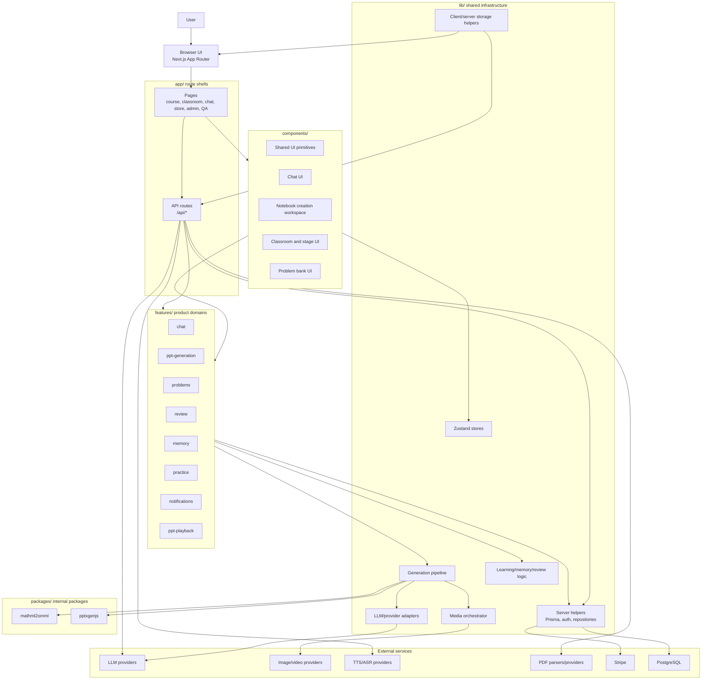

## 2. Next.js Route Map

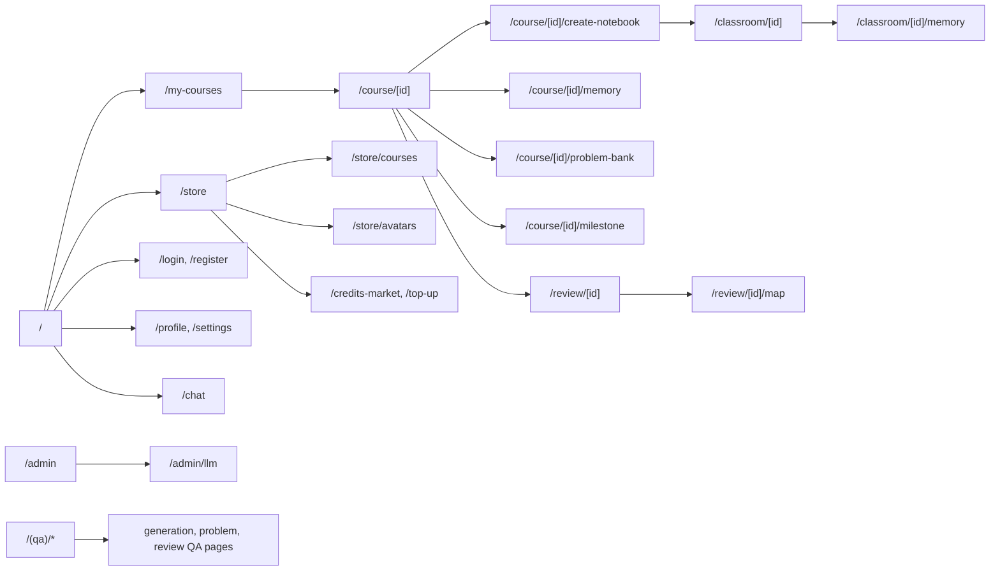

## 3. Server Domain Class Diagram

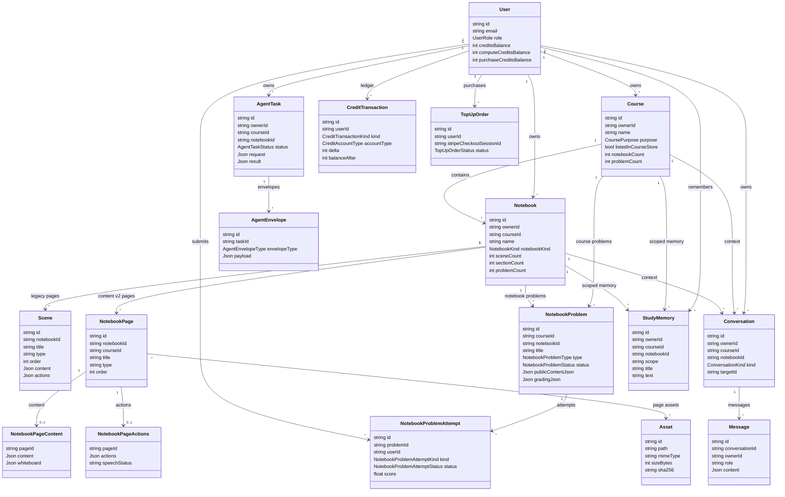

## 4. Client Data Model Diagram

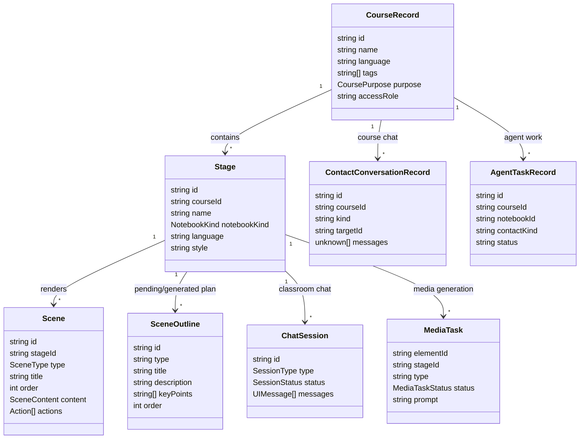

Note: client `Stage` is the historical frontend name for a notebook/classroom. On the server, the matching domain entity is `Notebook`.

## 5. Notebook Generation Sequence

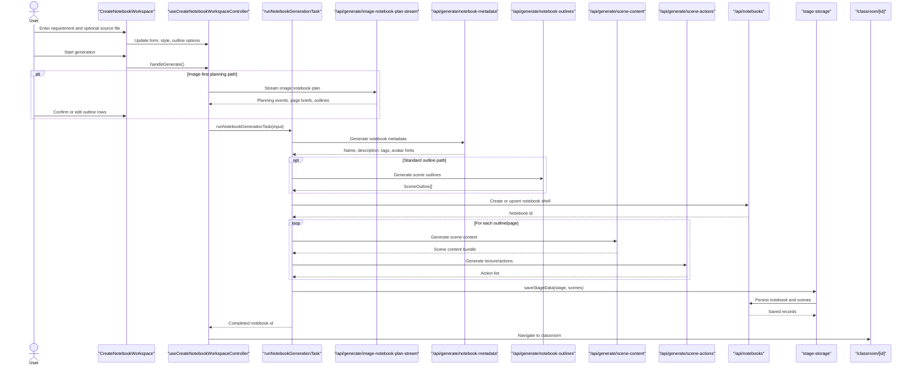

## 6. Scene Content Generation Sequence

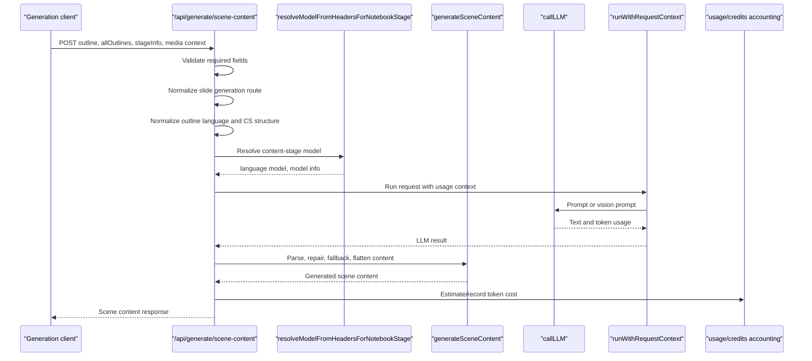

## 7. Chat And Agent Orchestration Sequence

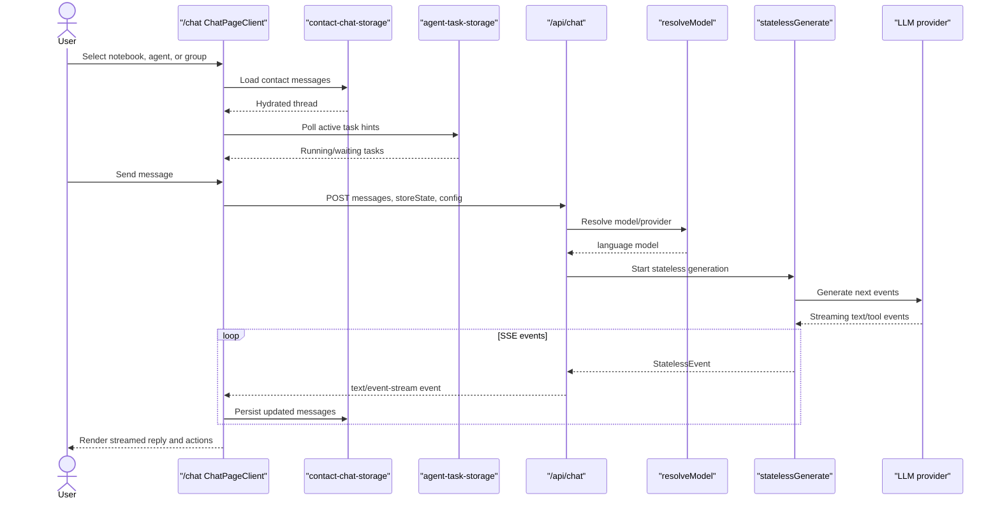

## 8. Course And Notebook Persistence Sequence

```mermaid
sequenceDiagram
  participant UI as "Client UI"
  participant CourseStorage as "course-storage"
  participant StageStorage as "stage-storage"
  participant CourseApi as "/api/courses"
  participant NotebookApi as "/api/notebooks"
  participant Repos as "server repositories"
  participant Prisma as "Prisma Client"
  database DB as "PostgreSQL"

  UI->>CourseStorage: listCourses/getCourse/createCourse
  CourseStorage->>CourseApi: backendJson request
  CourseApi->>Repos: list/create/update course
  Repos->>Prisma: Query Course relations
  Prisma->>DB: SQL
  DB-->>Prisma: Rows
  Prisma-->>Repos: Models
  Repos-->>CourseApi: Domain rows
  CourseApi-->>CourseStorage: JSON
  CourseStorage-->>UI: CourseRecord[]

  UI->>StageStorage: listStagesByCourse/loadStageData/saveStageData
  StageStorage->>NotebookApi: backendJson request
  NotebookApi->>Repos: list/create/update notebook and scenes
  Repos->>Prisma: Query Notebook, Scene, Page records
  Prisma->>DB: SQL
  DB-->>Prisma: Rows
  Prisma-->>Repos: Models
  Repos-->>NotebookApi: Domain rows
  NotebookApi-->>StageStorage: JSON
  StageStorage-->>UI: Stage and Scene data
```

## 9. Zustand State Diagram

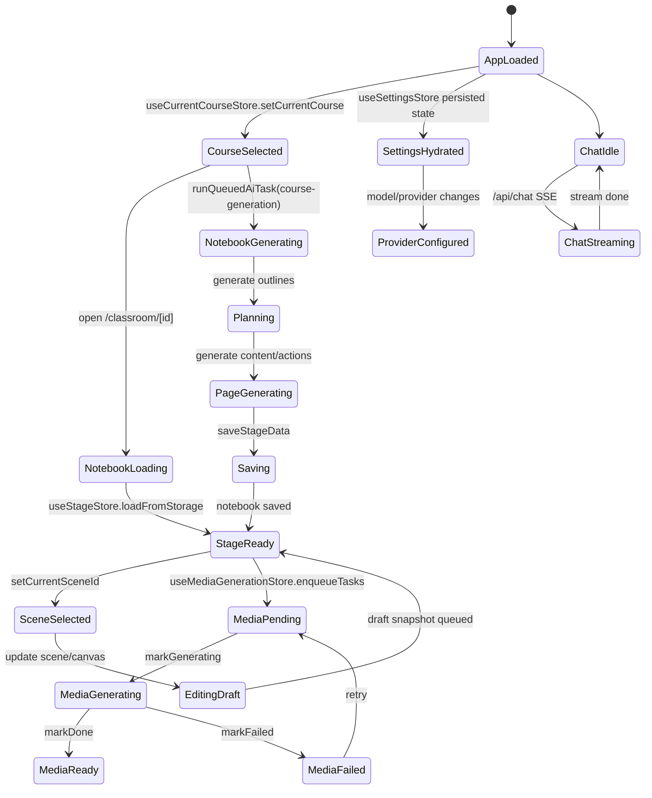

## 10. Store Responsibility Diagram

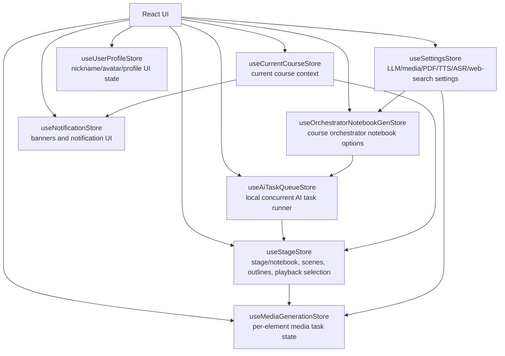

## 11. Problem Bank And Review Flow

```mermaid
flowchart LR
  CoursePage["Course detail"] --> ProblemBankPage["Problem bank page"]
  ProblemBankPage --> ImportPreview["/api/courses/[id]/problems/import-preview"]
  ImportPreview --> ProblemImport["features/problems/server/import"]
  ProblemImport --> ProblemDrafts["Problem drafts"]
  ProblemDrafts --> ImportCommit["/api/courses/[id]/problems/import-commit"]
  ImportCommit --> ProblemsRepo["Problem service/repository"]
  ProblemsRepo --> NotebookProblem["NotebookProblem"]

  ProblemBankPage --> ManualEdit["Manual create/edit"]
  ManualEdit --> ProblemsRepo

  NotebookProblem --> ReviewAssess["/api/review-route/assess-problem-bank"]
  ReviewAssess --> ReviewGenerate["/api/review-route/generate"]
  ReviewGenerate --> ReviewRoute["Review route"]
  ReviewRoute --> ReviewPage["/review/[id]"]
  ReviewPage --> Attempt["Problem attempt"]
  Attempt --> Grade["features/problems/server/evaluate/judge"]
  Grade --> Progress["NotebookProblemProgress"]
```

## 12. Gamification And Credits Flow

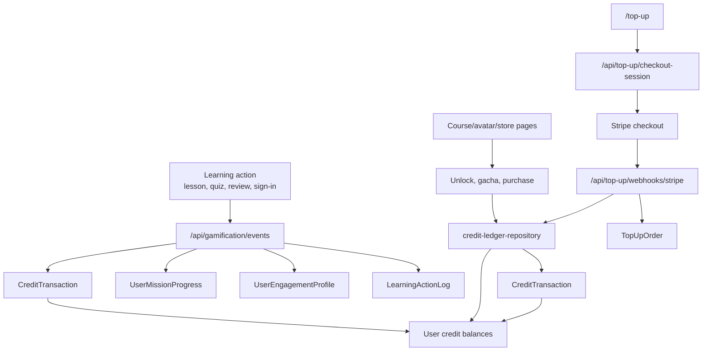

## 13. Deployment And Provider Diagram

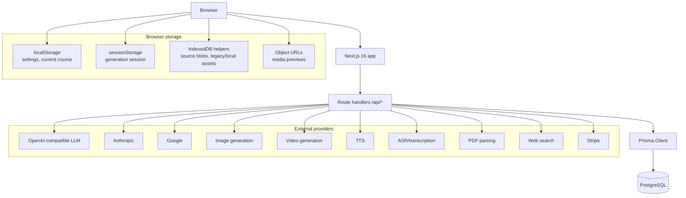

